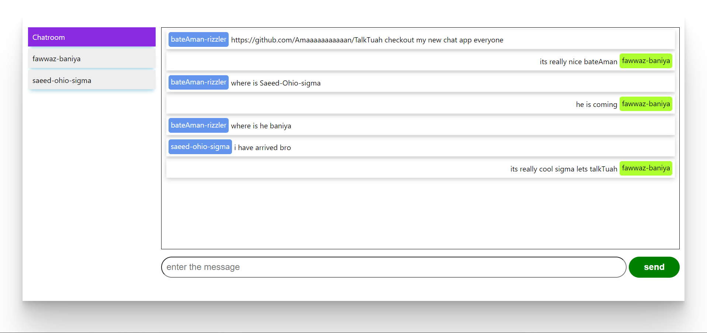

# TalkTuah
Spring boot websocket backend and reactjs client

#Pre-requisites
- hey there , Aman here to run this project you need to have Jdk 17.0 version
- install Apache-maven to run the server code

Server:
    - Spring boot Websocket - JAVA

Client
    - ReactJS

## ReactJS screen

To start:
    
### Client
        - npm install (run this command in integrated terminal by right clicking on react-client folder in VS-CODE)
        - npm start (run this to start the project on the local-host)
    
### Server
        - mvn spring-boot:run (in the spring-ws-server integrated termoinal in vs code)
